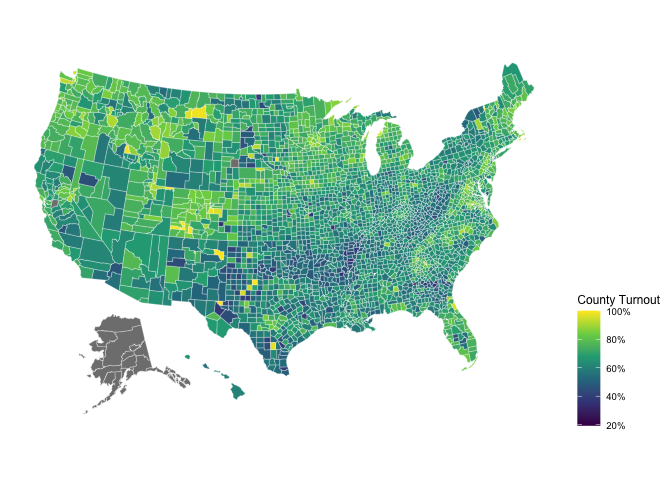

Estimating 2020 County Turnout
================
Kevin Reuning
12/11/2021

## Data

The data comes from two places. First, the total votes cast in 2020 by
county comes from the [MIT Election
Data](https://dataverse.harvard.edu/dataset.xhtml?persistentId=doi:10.7910/DVN/VOQCHQ).
Second, the [Census has
estimates](https://www.census.gov/programs-surveys/decennial-census/about/voting-rights/cvap.2019.html)
of eligible voting population by county but this is only updated through
2019. The fact is is only updated through 2019 will cause a small
problem at the end (fun).

``` r
library(data.table)
library(knitr)
vap_dt <- fread("County.csv")
elec_dt <- fread("countypres_2000-2020.csv")
```

### Fix FIPs problems

State FIPS codes are two digit numbers, county FIPS codes are three
digit numbers. Often the leading zeros will be lost when CSV or Excel
files are used as they are treated as numbers instead of strings. The
election dataset has a combined state and county FIPS code where leading
zeros are lost. `formatC()` formats a number and returns it as a
character.

The census voting age population data uses a more elaborate `geoid` code
where the FIPS code is embedded. `substr()` is used to get just a subset
of the string.

``` r
elec_dt[,county_fips:=formatC(county_fips, width=5, flag="0")]
head(elec_dt$county_fips)
```

    ## [1] "01001" "01001" "01001" "01001" "01003" "01003"

``` r
vap_dt[,county_fips:=substr(geoid, 8, 12)]
head(vap_dt$county_fips)
```

    ## [1] "01001" "01001" "01001" "01001" "01001" "01001"

### Selecting just voter turnout data

``` r
elec_dt_20 <- elec_dt[year ==2020, .(year, state, county_name, county_fips, totalvotes)]
elec_dt_20 <- unique(elec_dt_20)
dim(elec_dt_20)
```

    ## [1] 3155    5

### Selection just the total VAP data

``` r
vap_dt <- vap_dt[lntitle=="Total",]
dim(vap_dt)
```

    ## [1] 3220   13

### Check to see what counties are missing

``` r
missing_fips <- vap_dt[which(!county_fips %in% elec_dt_20$county_fips), county_fips]
table(substr(missing_fips, 0, 2))
```

    ## 
    ## 02 11 15 46 72 
    ## 26  1  1  1 78

``` r
missing_fips <- elec_dt_20[which(!county_fips %in% vap_dt$county_fips), county_fips]
table(substr(missing_fips, 0, 2))
```

    ## 
    ##    02 36 46 
    ##  2 38  1  1

`02` is Alaska (which is a hint at the problems to come) and `72` is
Puerto Rico which should not be in the election data. The other appear
to be a handful of random counties that I am guessing are missing
because counties change sometimes and FIPS codes change sometimes.

## Merge data together and calculate turnout

``` r
turnout_dt <- merge(vap_dt, elec_dt_20, by="county_fips")
turnout_dt[,turnout_rate:=totalvotes/cvap_est]
range(turnout_dt$turnout_rate, na.rm=T)
```

    ## [1] 0.03552912 3.44330357

``` r
turnout_dt[turnout_rate>1 | turnout_rate < 0.1, .(geoname, cvap_est, totalvotes, turnout_rate)]
```

    ##                                geoname cvap_est totalvotes turnout_rate
    ##  1:     Aleutians East Borough, Alaska     2240       7713   3.44330357
    ##  2: Aleutians West Census Area, Alaska     3380       8118   2.40177515
    ##  3:     Anchorage Municipality, Alaska   211010       7497   0.03552912
    ##  4:           Dolores County, Colorado     1435       1449   1.00975610
    ##  5:           Mineral County, Colorado      730        756   1.03561644
    ##  6:             Ouray County, Colorado     3990       4020   1.00751880
    ##  7:          San Juan County, Colorado      515        562   1.09126214
    ##  8:         Harding County, New Mexico      360        505   1.40277778
    ##  9:        Hanson County, South Dakota     2335       2388   1.02269807
    ## 10:                 King County, Texas      145        159   1.09655172
    ## 11:               Loving County, Texas       60         66   1.10000000
    ## 12:               Daggett County, Utah      480        619   1.28958333
    ## 13:         Grand Isle County, Vermont     5710       5782   1.01260946

### Fixing Problems

It looks like the MIT election data is providing data using legislative
districts but giving it FIPS codes that look like county data, so we
will have to remove all the Alaska data. There are about 10 small
counties that report higher turnout than voters. This is likely a result
of the fact we are using 2019 VAP data instead of 2020. :shrug:

``` r
turnout_dt <- turnout_dt[state!="ALASKA",]
```

## Export Data

``` r
write.csv(turnout_dt[,.(county_fips,county_name, state, turnout_rate, totalvotes, 
              cvap_est, tot_est)], 
          file="county_turnout_2020.csv")
```

## Making a map

Legally speaking you cannot combine this data without creating a map
even though it has been done a million times before.

``` r
library(usmap)
library(ggplot2)
names(turnout_dt)[1] <- "fips"
turnout_dt[turnout_rate>1,turnout_rate:=1]
p <- plot_usmap(regions="counties", data=turnout_dt, values="turnout_rate", 
                color = "white", size=.1) 
p + scale_fill_viridis_c("County Turnout", labels=scales::label_percent()) + 
  theme(legend.position = "right")
```

    ## Warning: Use of `map_df$x` is discouraged. Use `x` instead.

    ## Warning: Use of `map_df$y` is discouraged. Use `y` instead.

    ## Warning: Use of `map_df$group` is discouraged. Use `group` instead.

<!-- -->
